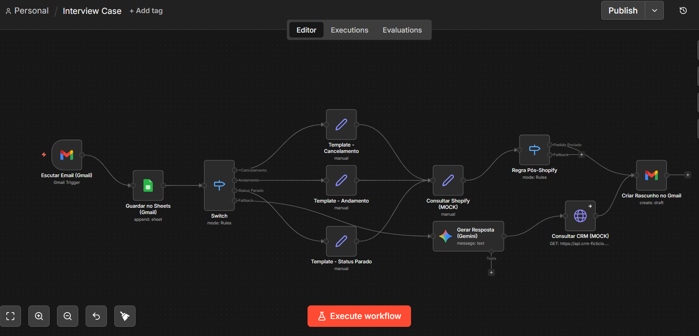
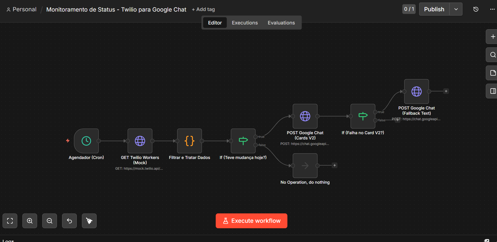
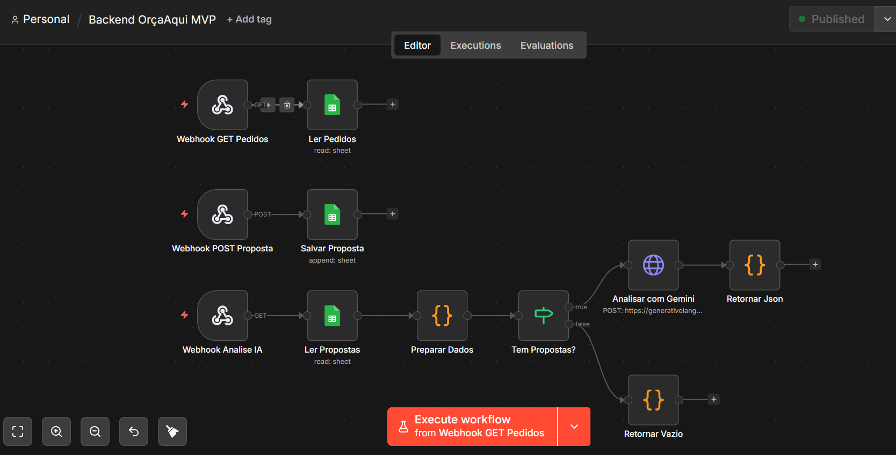
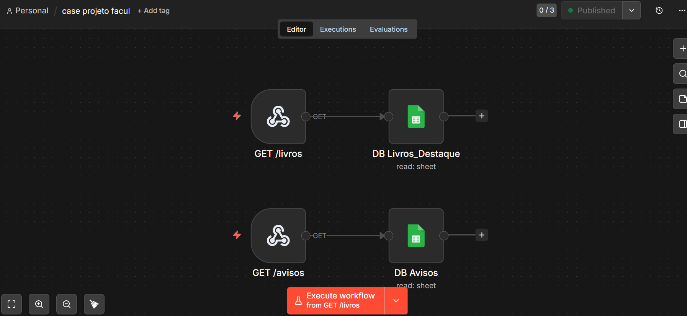

# Portfólio de Automações e Integrações (n8n)

Este repositório contém as exportações JSON dos meus principais workflows construídos no **n8n**.

Cada arquivo `.json` presente aqui pode ser importado diretamente para qualquer instância do n8n para visualização do fluxo. Abaixo, detalho a arquitetura e o propósito de cada um deles.

---

## 1. Suporte Automatizado ao Cliente

**Arquivo:** `Interview_Case.json`

Um case técnico focado em otimização de atendimento ao cliente via e-mail, utilizando inteligência artificial para ler, classificar e redigir respostas baseadas em dados de plataformas externas (Mocks de Shopify e CRM).

**Arquitetura do Fluxo:**
1. **Trigger:** Monitora a caixa de entrada do Gmail buscando por e-mails com a tag "Pendente".
2. **Registro:** Faz o backup do e-mail recebido em uma planilha do Google Sheets.
3. **Roteamento:** Um nó `Switch` atua como roteador principal, analisando o conteúdo/assunto para direcionar o fluxo para a esteira correta de atendimento (Cancelamento, Andamento, Parado ou Fallback).
4. **Respostas Templates:** Para cenários conhecidos, injeta respostas padronizadas em templates, mantendo o tom de voz da marca.
5. **Enriquecimento de Dados:** Faz consultas a APIs simuladas (Shopify para status de pedidos e CRM para histórico do cliente).
6. **IA Generativa:** Emprega o Google Gemini para analisar os dados enriquecidos e gerar uma resposta humanizada e contextualizada.
7. **Ação Final:** Cria um rascunho (draft) da resposta no Gmail, pronto para ser revisado ou disparado por um atendente humano.

**Destaques de Engenharia:**
- Uso de nós condicionais e lógicos (`Switch`, `If`) para garantir que apenas os fluxos necessários sejam executados, economizando recursos.
- Tratamento de Mocks de API para simular um ambiente de produção real.
- Delegação de tarefas cognitivas (entendimento de contexto) para LLMs (Large Language Models).

---

## 2. Monitoramento de Status de Agentes (Twilio ➜ Google Chat)

**Arquivo:** `Twilio_GoogleChat_Monitor.json`

Um fluxo automatizado de ETL e monitoramento em tempo real. O n8n se conecta à API da Twilio para extrair os status dos agentes de atendimento, processa os dados com regras de negócios avançadas e dispara alertas visuais no Google Chat.

**Arquitetura do Fluxo:**
1. **Agendador (Cron):** Dispara a rotina em intervalos definidos (ex: a cada 30 minutos).
2. **Extração de Dados:** Realiza um GET autenticado na API da Twilio TaskRouter (simulado via Mocks).
3. **Processamento (Code Node):** Filtra agentes desconectados, consolida mudanças recentes de status e estrutura o payload utilizando JavaScript.
4. **Controle de Fluxo (`If`):** Valida se houveram alterações antes de prosseguir, economizando recursos computacionais.
5. **Ação Principal:** Dispara um Webhook para o Google Chat utilizando uma interface rica (Cards V2).
6. **Resiliência (Fallback):** Uma segunda trava lógica verifica se a API do Google Chat retornou erro (ex: falha na renderização do Card). Em caso positivo, o fluxo regride graciosamente para enviar um alerta em texto puro.

**Destaques de Engenharia:**
- Tratamento de exceções nativo do n8n atrelado a nós de roteamento condicional.
- Implementação de um padrão de "Fallback" garantindo a entrega da mensagem independente da complexidade visual suportada pelo canal de destino.

---

## 3. Backend MVP (OrçaAqui)

**Arquivo:** `Backend_OrcaAqui_MVP.json`

Desenvolvido para atuar como o backend completo de uma aplicação SaaS (Single Page Application hospedada na Vercel). O n8n expõe Webhooks que o Front-End consome via fetch nativo, eliminando a necessidade de um servidor Node.js intermediário.

**Arquitetura do Fluxo:**
1. **Webhooks GET/POST:** Atuam como endpoints de uma API RESTful.
   - `/webhook/orcaaqui-get-pedidos`: Retorna a lista de pedidos.
   - `/webhook/orcaaqui-post-proposta`: Recebe novas propostas e salva no banco de dados.
   - `/webhook/orcaaqui-analise-ia`: Endpoint avançado para análise inteligente.
2. **Banco de Dados (Google Sheets):** Leitura e escrita otimizada na planilha que atua como o banco relacional do MVP.
3. **IA Analítica (Gemini):**
   - Recebe um `id_pedido`.
   - Busca no banco todas as propostas relacionadas a esse ID.
   - Envia o contexto em lote para o Google Gemini via requisição HTTP (API REST nativa).
   - A IA atua como um "consultor financeiro", comparando as propostas, apontando o melhor custo-benefício e formatando a saída de volta para o frontend.
4. **Tratamento de Rate Limit:** O frontend consome este fluxo já esperando possíveis respostas HTTP `429 Too Many Requests`, lidando de forma graciosa com os limites da IA.

**Destaques de Engenharia:**
- Construção de "API-less Backend": O n8n assume total responsabilidade pelas regras de negócios e rotas.
- Otimização de prompts para que a IA processe matrizes de dados complexos (múltiplas propostas e valores) e retorne insights diretos.

---

## 4. Integração Simples de Dados (Case de Faculdade)

**Arquivo:** `case_projeto_facul.json`

Um projeto acadêmico demonstrando os fundamentos de extração e disponibilização de dados utilizando Webhooks como micro-serviços.

**Arquitetura do Fluxo:**
1. **Endpoint 1 (`/livros`):** Acionado via GET, busca dados em uma tabela "Livros_Destaque" e retorna o payload limpo para o front-end consumir.
2. **Endpoint 2 (`/avisos`):** Acionado via GET, busca dados em uma tabela "Avisos" e retorna a lista de recados.

**Destaques de Engenharia:**
- Demonstra entendimento da estrutura `Request -> Process -> Response`.
- Uso eficiente de Webhooks para servir conteúdo dinâmico (Headless CMS com Google Sheets).

---

## 5. Processador de Dados WFM (ETL com Pandas)
**Pasta:** `subprojetos-automacao-com-linguagem-programacao/`

Um script Python desenvolvido para modernizar e escalar as regras de negócio de **Workforce Management**. Ele converte cálculos complexos de planilhas eletrônicas (apuração de ponto, banco de horas e pausas do sistema Twilio) para um algoritmo performático utilizando a biblioteca **Pandas**. Demonstra habilidade sólida em Engenharia de Dados para operações de backoffice.

