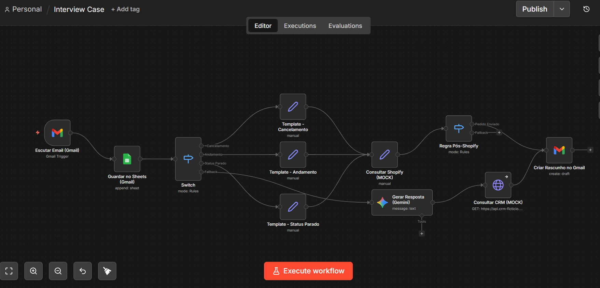
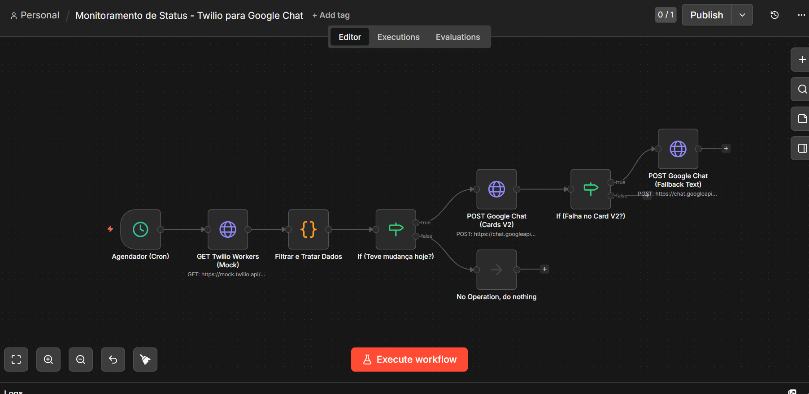
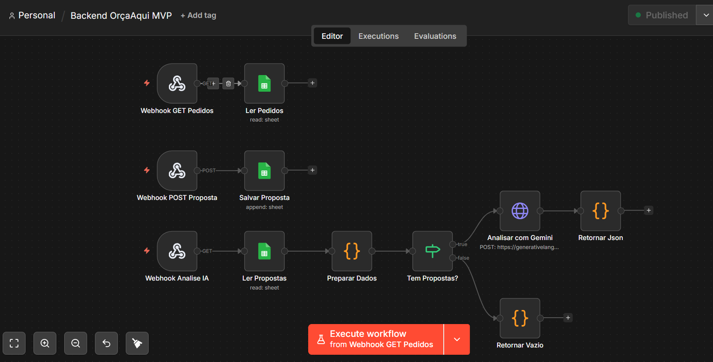
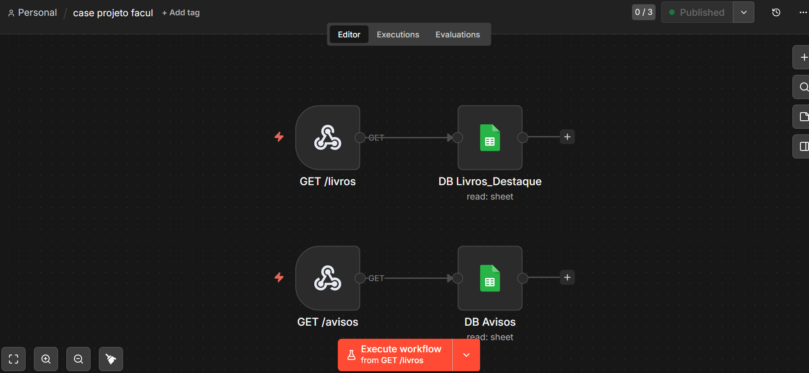

# Portfólio de Automações e Integrações (n8n)

Este repositório reúne exportações JSON dos meus principais workflows construídos no **n8n**. Cada arquivo pode ser importado diretamente em uma instância do n8n para estudo e configuração.

> **Configuração:** por segurança, credenciais, chaves de API, IDs de planilhas, canais, workspaces e dados pessoais foram removidos ou substituídos por placeholders. Após importar um workflow, configure as credenciais e os identificadores indicados antes de ativá-lo.

---

## 1. Gerador de Lógica Avançada — Clipping e Palavras-chave

**Arquivo:** `Gerador_Logica_Avancada_Clipping.json`

Uma esteira inteligente de clipping que transforma solicitações registradas no Google Sheets em pesquisas estruturadas. O workflow gera e refina palavras-chave, consulta múltiplas fontes, normaliza o resultado e mantém um histórico operacional completo.

**Arquitetura do Fluxo:**

1. **Agendador:** verifica novas solicitações a cada 10 minutos.
2. **Leitura e validação:** busca itens pendentes no Google Sheets e valida os campos necessários antes do processamento.
3. **Controle de estado:** marca a solicitação como em processamento para evitar execução duplicada.
4. **Motor de IA:** utiliza um agente com Google Gemini para interpretar o briefing, gerar palavras-chave e conduzir a pesquisa.
5. **Pesquisa multicanal:** combina Google/SerpAPI, YouTube, Wikipedia e acesso direto a páginas.
6. **Fallback inteligente:** aciona um segundo agente baseado em OpenAI quando o processamento principal não produz uma resposta válida.
7. **Normalização:** valida a estrutura retornada, restaura o contexto original e prepara o resultado final.
8. **Persistência:** grava retorno e histórico no Google Sheets, atualiza o status e direciona falhas para revisão.

**Destaques de Engenharia:**

- Orquestração de agentes com ferramentas especializadas e múltiplas fontes de pesquisa.
- Estratégia de fallback entre provedores de IA para aumentar a resiliência.
- Máquina de estados no Google Sheets para rastreabilidade e prevenção de duplicidades.
- Validação e normalização do JSON gerado antes da persistência.

---

## 2. Draftly — Suporte Automatizado ao Cliente

**Arquivo:** `Draftly_Case.json`

Um case técnico focado em otimização do atendimento por e-mail. A automação lê e classifica solicitações, consulta dados de apoio e cria respostas contextualizadas para revisão humana.

**Arquitetura do Fluxo:**

1. **Trigger:** monitora a caixa de entrada do Gmail em busca de mensagens pendentes.
2. **Registro:** salva os dados recebidos no Google Sheets.
3. **Roteamento:** classifica os chamados em cancelamento, andamento, pedido parado ou fallback.
4. **Templates:** aplica respostas padronizadas aos cenários conhecidos.
5. **Enriquecimento:** consulta mocks de Shopify e CRM para complementar o contexto do pedido e do cliente.
6. **IA generativa:** utiliza o Google Gemini para redigir uma resposta humanizada nos casos que exigem interpretação.
7. **Revisão humana:** cria um rascunho no Gmail, pronto para conferência antes do envio.

**Destaques de Engenharia:**

- Uso de `Switch` para reduzir chamadas desnecessárias e separar regras de negócio.
- Combinação de respostas determinísticas com IA apenas onde ela agrega valor.
- Human-in-the-loop por meio de rascunhos, evitando disparos automáticos sem revisão.

---

## 3. Laboratório de Auditoria A/B — Try/Catch + IA

**Arquivo:** `Laboratorio_Auditoria_AB_TryCatch_IA.json`

Um laboratório de auditoria de páginas que recebe uma URL por webhook, tenta diferentes estratégias de captura e produz um laudo estruturado com apoio de inteligência artificial quando necessário.

**Arquitetura do Fluxo:**

1. **Entrada:** recebe via webhook POST a URL que será auditada.
2. **Captura principal:** tenta acessar e renderizar a página por um serviço Browserless.
3. **Detecção de bloqueio:** identifica sucesso, CAPTCHA ou erro técnico por meio de um `Switch`.
4. **Try/Catch operacional:** diante de bloqueio, repete a captura por uma rota alternativa usando ScraperAPI.
5. **Validação determinística:** um nó de código aplica regex e comparações objetivas ao conteúdo coletado.
6. **Escalonamento para IA:** o Gemini é chamado apenas quando as regras não conseguem concluir a auditoria.
7. **Saída e histórico:** formata o laudo, registra o resultado no Google Sheets e responde ao webhook.

**Destaques de Engenharia:**

- Estratégia de recuperação em camadas para páginas protegidas ou instáveis.
- Uso seletivo de IA, reduzindo custo e latência quando regras determinísticas bastam.
- Resposta síncrona por webhook com persistência do laudo para auditoria futura.

---

## 4. Roteador de Chamados ClickUp

**Arquivo:** `Roteador_Chamados_ClickUp.json`

Automação de triagem e distribuição de novos chamados no ClickUp. O fluxo identifica a área responsável e aplica regras de round-robin para equilibrar a carga entre os integrantes disponíveis.

**Arquitetura do Fluxo:**

1. **Trigger:** reage à criação de uma tarefa no ClickUp.
2. **Enriquecimento:** consulta a tarefa e os membros da workspace pela API.
3. **Validação:** interpreta os dados do chamado e define o destino operacional.
4. **Roteamento:** separa os fluxos de TVR, Impresso/Web, TI e Qualidade.
5. **Distribuição:** executa regras independentes de round-robin para cada equipe.
6. **Atribuição:** atualiza a tarefa via API do ClickUp com o responsável selecionado.

**Destaques de Engenharia:**

- Balanceamento de carga com regras de distribuição por área.
- Separação clara entre validação, roteamento e atribuição.
- Uso combinado de trigger nativo e chamadas HTTP para ampliar o controle sobre a API.

---

## 5. Daily Digest CX & OP

**Arquivo:** `Daily_Digest_CX_OP.json`

Uma rotina de acompanhamento operacional que consolida tarefas e comentários do ClickUp, calcula indicadores de SLA e publica um resumo executivo no Slack em dois momentos do dia.

**Arquitetura do Fluxo:**

1. **Agendamento:** executa em dias úteis nos horários configurados para os turnos da operação.
2. **Coleta:** busca tarefas e comentários recentes no ClickUp.
3. **Processamento:** filtra os registros, organiza os dados por responsável e calcula indicadores de SLA.
4. **Persistência:** grava a base consolidada no Google Sheets.
5. **Resumo por IA:** utiliza o Gemini para gerar o digest em linguagem natural.
6. **Fallback:** aguarda uma nova tentativa e aciona a OpenAI caso o provedor principal falhe.
7. **Comunicação:** publica o digest no Slack ou envia um aviso operacional caso ambos os modelos estejam indisponíveis.

**Destaques de Engenharia:**

- Pipeline completo de coleta, transformação, análise e comunicação.
- Fallback entre modelos com tratamento explícito de falha.
- Continuidade operacional: os dados permanecem registrados mesmo quando a geração do texto falha.

---

## 6. Monitoramento de Status de Agentes (Twilio ➜ Google Chat)

**Arquivo:** `Twilio_GoogleChat_Monitor.json`

Um fluxo automatizado de ETL e monitoramento. O n8n se conecta à API da Twilio para extrair os status dos agentes, processa regras de negócio e dispara alertas visuais no Google Chat.

**Arquitetura do Fluxo:**

1. **Agendador:** dispara a rotina em intervalos definidos.
2. **Extração:** consulta a API da Twilio TaskRouter.
3. **Processamento:** filtra agentes desconectados e consolida mudanças recentes de status.
4. **Controle de fluxo:** valida se houve alterações antes de prosseguir.
5. **Notificação:** envia um card visual ao Google Chat.
6. **Fallback:** se o card falhar, envia um alerta em texto simples.

**Destaques de Engenharia:**

- Tratamento de exceções associado a nós de roteamento condicional.
- Fallback que preserva a entrega mesmo quando o formato visual não é aceito.

---

## 7. Backend MVP — OrçaAqui

**Arquivo:** `Backend_OrcaAqui_MVP.json`

Workflow desenvolvido para atuar como backend de uma aplicação SaaS. O n8n expõe webhooks consumidos diretamente pelo front-end, centralizando rotas, persistência e análise inteligente.

**Arquitetura do Fluxo:**

1. **Webhooks GET/POST:** funcionam como endpoints de uma API REST.
2. **Banco de dados:** utiliza Google Sheets para leitura e escrita dos registros do MVP.
3. **IA analítica:** compara propostas relacionadas a um pedido e retorna uma recomendação de custo-benefício.
4. **Tratamento de limites:** prevê respostas de rate limit e permite tratamento gracioso pelo front-end.

**Destaques de Engenharia:**

- Backend de MVP construído integralmente no n8n.
- Prompts orientados à análise de múltiplas propostas e valores.

---

## 8. Integração Simples de Dados — Case de Faculdade

**Arquivo:** `case_projeto_facul.json`

Projeto acadêmico que demonstra os fundamentos de extração e disponibilização de dados usando webhooks como microsserviços.

**Arquitetura do Fluxo:**

1. **Endpoint `/livros`:** busca a tabela de livros em destaque e retorna os dados para o front-end.
2. **Endpoint `/avisos`:** busca uma tabela de avisos e devolve a lista de recados.

**Destaques de Engenharia:**

- Aplicação direta do ciclo `Request → Process → Response`.
- Uso de webhooks e Google Sheets como um CMS headless simples.

---

## Como importar

1. Baixe o arquivo JSON desejado.
2. No n8n, abra **Workflows** e selecione **Import from File**.
3. Configure as credenciais e substitua os placeholders `CONFIGURE_*`, `YOUR_*` e `REPLACE_WITH_*`.
4. Revise triggers, horários, IDs e permissões.
5. Teste o fluxo manualmente antes de ativá-lo.
